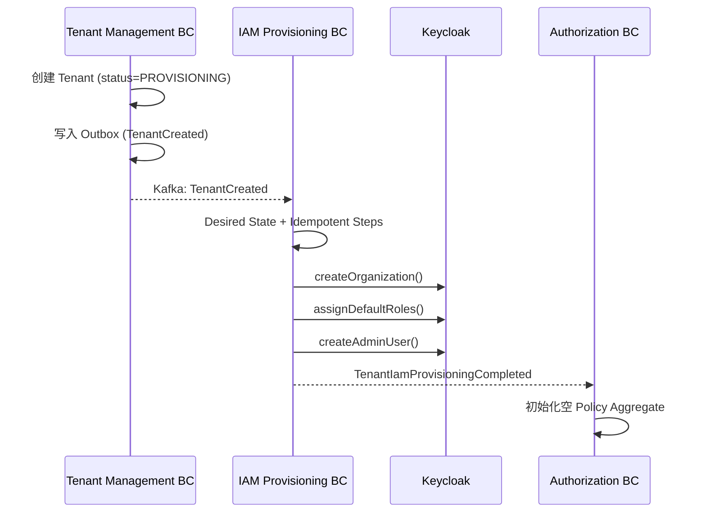
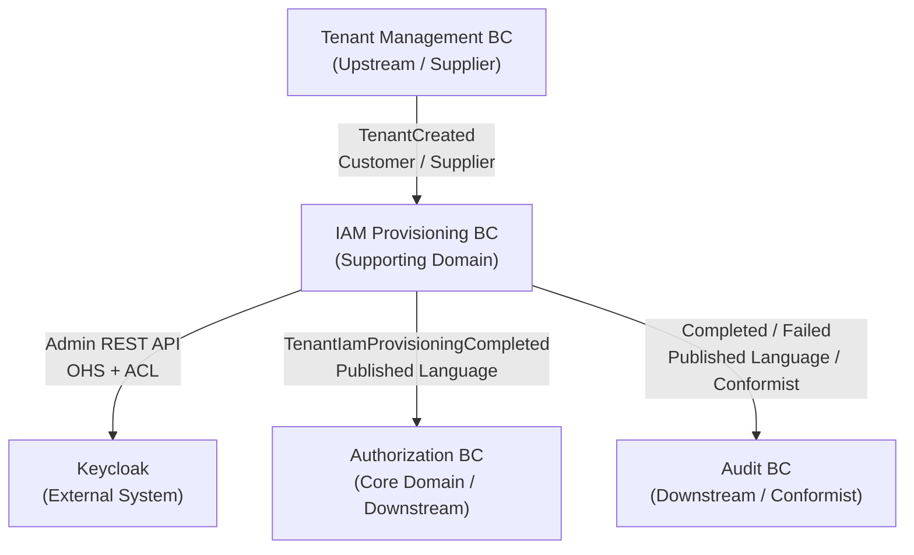
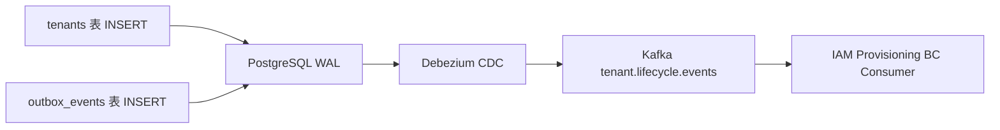
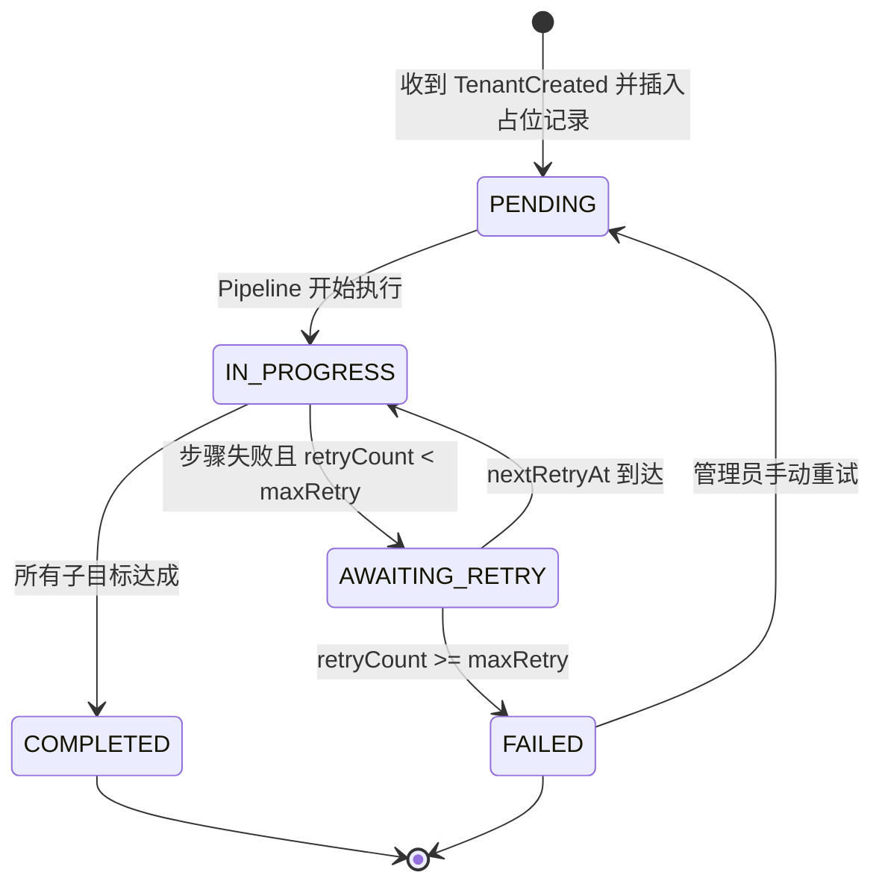
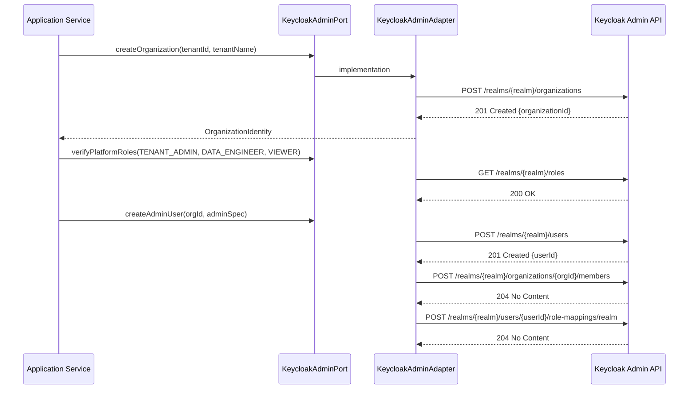
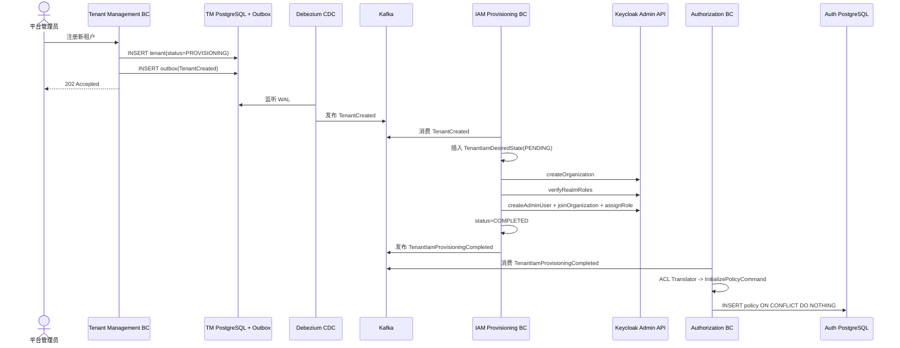

**CDP 多租户平台**

**Identity & Access Layer**

Tenant IAM Provisioning / Identity Provisioning BC

DDD 设计与实施文档

_Sessions F1, F3, F2, F4, G 完整设计记录 | 版本 1.0_

# 目录

第一章 教学全景与 BC 定位

第二章 战略设计：为什么需要独立的 IAM Provisioning BC

第三章 Context Map 与跨 BC 协作关系

第四章 可靠触发机制：Outbox、Debezium、At-least-once 与幂等性

第五章 战术设计：TenantIamDesiredState 与 Idempotent Step Pipeline

第六章 Keycloak Admin Port 实施设计

第七章 Authorization BC 响应 TenantIamProvisioningCompleted

第八章 关键补充专题

第九章 架构决策与开放问题

# 第一章 教学全景与 BC 定位

## 1.1 Source Pages

本文档整理自 Notion 页面 `Tenant IAM Provisioning / Identity Provisioning BC DDD` 及其子页面。

| 页面 | Notion URL |
| --- | --- |
| Tenant IAM Provisioning / Identity Provisioning BC DDD | https://www.notion.so/369cb22c433580888db9d8d5add2473a |
| Session F1 - 战略设计：为什么需要单独一个 BC？ | https://www.notion.so/369cb22c433580d19fe0c9eceeada62e |
| Session F3 - 触发机制深入：事件是怎么可靠传递的？ | https://www.notion.so/369cb22c433580218114d34a3fb9ed7a |
| Session F2 - 战术设计：内部怎么实现？ | https://www.notion.so/369cb22c433580faa339ca4d3f383ebd |
| Session F4 - Keycloak Admin Port 实施设计 | https://www.notion.so/369cb22c433580cb9c5edf4af219cad2 |
| Session G - Authorization BC 响应 TenantIamProvisioningCompleted | https://www.notion.so/36acb22c433580adbc23f425460c7d11 |
| Saga 补偿适合的场景是“操作本质上不可幂等” | https://www.notion.so/369cb22c43358011bdbfc9a8071ebca3 |
| PENDING 状态是如何解决重复消费的？ | https://www.notion.so/369cb22c433580dfba34efaf519a0a91 |
| RetryScheduler 是什么，怎么实现的 | https://www.notion.so/369cb22c4335805095a4eda5a234eb0a |
| CQRS 本地投影 Local Projection | https://www.notion.so/36acb22c433580b9b045c7b94ad0ad81 |
| 竞态条件 Race Condition | https://www.notion.so/36acb22c4335803f90a8c58c525275fc |
| ACL 将外部事件转化为内部 Command | https://www.notion.so/36acb22c433580108247d86aa7a0d7b2 |

## 1.2 教学路径

在 Identity & Access Layer 的 DDD 学习地图中，Authorization BC 已经完成 Sessions A-E 的战略和战术设计。Tenant IAM Provisioning BC 是下一块关键拼图，它回答的问题是：

> 一个新租户注册成功后，Identity 层如何从零开始被激活？

没有 IAM Provisioning BC，Authorization BC 无从运作，因为 Keycloak Organization、平台角色、初始管理员账号都需要先完成创建或校验。

本轮教学规划如下：

| Session | 主题 | 解决的问题 |
| --- | --- | --- |
| F1 | 战略设计 | 为什么需要单独一个 BC，职责边界在哪里 |
| F3 | 触发机制深入 | TenantCreated 事件如何可靠传递 |
| F2 | 战术设计 | Desired State、状态机、幂等 Pipeline、重试策略 |
| F4 | Keycloak Admin Port | Port/Adapter 如何隔离 Keycloak，OQ-01 如何决策 |
| G | Authorization BC 响应 | IAM Provisioning 与 Authorization BC 如何闭环 |

## 1.3 整体关系



# 第二章 战略设计：为什么需要独立的 IAM Provisioning BC

## 2.1 从变化原因判断边界

Tenant Management BC 和 IAM Provisioning BC 的变化原因不同。

Tenant Management BC 关注：

- 租户元数据结构变化，例如新增行业分类字段
- 租户状态流转规则变化
- tier、region、plan 等管理属性变化
- 租户生命周期事实本身

IAM Provisioning BC 关注：

- Keycloak Admin API 或版本升级
- Identity Provider 从 Keycloak 换成 Auth0、Okta、Cognito
- 初始管理员凭据分发策略变化
- Enterprise 租户新增 SAML SSO 或外部 IdP 配置
- Organization、Role、Admin User 的创建和校验步骤变化

结论：两者拥有不同的 Single Reason to Change。如果把 Keycloak 调用直接塞进 Tenant Management BC，Tenant Management 会被外部 IdP 的技术变化污染。

## 2.2 从失败域判断边界

Keycloak 临时不可用时，合理结果应该是：

- Tenant 记录已经创建，状态保持在 `PROVISIONING`
- IAM Provisioning 进入等待重试或失败告警
- Keycloak 恢复后继续执行未完成步骤

不合理结果是：

- Tenant 创建整体失败，无法保留生命周期事实
- Tenant Management 事务被 Keycloak 可用性强绑定
- Keycloak 的短暂故障扩大成租户管理能力不可用

因此，Tenant 创建和 IAM Provisioning 必须处于不同事务边界，允许独立失败、独立重试、独立观测。

## 2.3 子域归属：Supporting Domain

Tenant IAM Provisioning BC 是 Supporting Domain。

判断依据：

- 必须有：没有它，新租户无法登录系统
- 不差异化：在 Keycloak 创建 Organization、角色、管理员账号不是 CDP 平台的护城河
- 可替代：未来可以由 Okta Workflows、Auth0 Actions、Azure AD B2C Provisioning API 或外部 IAM 工作流替代

Authorization BC 是 Core Domain，因为它承载平台差异化授权模型、ABAC 策略评估、租户自定义角色和授权决策。IAM Provisioning BC 需要可靠、可维护、可替换，不应过度设计成核心业务创新点。

## 2.4 职责边界

IAM Provisioning BC 负责：

- 消费 `TenantCreated` 事实型事件
- 创建或确保 Keycloak Organization 存在
- 校验平台 Realm Role 已就绪
- 创建初始 `TENANT_ADMIN` 用户
- 将初始管理员加入 Organization
- 将 `TENANT_ADMIN` Realm Role 赋给初始管理员
- 维护本地 IAM provisioning desired state
- 发布 `TenantIamProvisioningCompleted` 或 `TenantIamProvisioningFailed`

IAM Provisioning BC 不负责：

- 管理 Tenant 元数据 Source of Truth
- 直接创建或修改 Authorization BC 的 Policy、Role、RoleAssignment
- 直接读写 Authorization BC 数据库
- 注册每租户 OAuth2 Client
- 处理租户业务数据权限
- 存储或分发明文密码

# 第三章 Context Map 与跨 BC 协作关系

## 3.1 Context Map 总览



## 3.2 Tenant Management BC 到 IAM Provisioning BC

模式：Customer / Supplier。

Tenant Management BC 是上游，因为它掌握“租户被创建”的第一手事实。IAM Provisioning BC 是下游消费者，被上游事件触发。

IAM Provisioning BC 的 Consumer 侧必须有 ACL 翻译层，不能直接让上游事件对象进入 Domain 层。

```java
class TenantCreatedEventTranslator {
    TenantIamRequest translate(TenantCreatedIntegrationEvent event) {
        return TenantIamRequest.of(
            TenantId.of(event.getTenantId()),
            AdminEmail.of(event.getAdminEmail()),
            TierLevel.from(event.getTier())
        );
    }
}
```

如果上游将 `adminEmail` 改名为 `ownerEmail`，变化只影响 Translator，不影响 IAM Provisioning BC 内部领域模型。

## 3.3 IAM Provisioning BC 到 Keycloak

模式：Open Host Service + Anti-Corruption Layer。

Keycloak 通过 Admin REST API 暴露能力，这是外部系统的 OHS。Keycloak 的语言包括 `realm`、`OrganizationRepresentation`、`CredentialRepresentation`、HTTP status code 等，不能进入 IAM Provisioning BC 的 Domain 或 Application 核心。

IAM Provisioning BC 通过 `KeycloakAdminPort` 说业务语言，由 `KeycloakAdminAdapter` 翻译成 Keycloak REST 调用。

## 3.4 IAM Provisioning BC 到 Authorization BC

模式：Published Language / Event-Driven。

IAM Provisioning 完成后，只发布事实型事件：

```text
TenantIamProvisioningCompleted
```

Authorization BC 自主决定如何响应，例如初始化空 Policy。IAM Provisioning BC 不得直接调用 Authorization BC Repository、不得直接写 Authorization BC 数据库、不得操作 Policy / Role / RoleAssignment Aggregate。

边界红线：

> IAM Provisioning BC 在任何情况下不得直接读写 Authorization BC 的数据库 Schema，不得直接调用 Authorization BC 的内部 Repository，不得操作 Authorization BC 的 Policy、Role、RoleAssignment Aggregate。所有跨 BC 影响必须通过领域事件传递。

## 3.5 IAM Provisioning BC 到 Audit BC

模式：Published Language / Conformist。

Audit BC 可以直接消费 `TenantIamProvisioningCompleted` 和 `TenantIamProvisioningFailed`，按上游 Schema 记录审计日志。因为 Audit BC 的职责是记录发生了什么，维护额外 ACL 的收益较低，可以采用 Conformist。

# 第四章 可靠触发机制：Outbox、Debezium、At-least-once 与幂等性

## 4.1 双写问题

朴素实现通常是：

```java
public void createTenant(CreateTenantCommand cmd) {
    tenantRepository.save(tenant);
    kafkaTemplate.send("tenant.events", new TenantCreatedEvent(tenant));
}
```

这会触发 Dual Write Problem：

| 场景 | 结果 |
| --- | --- |
| DB 写入成功，Kafka 发送失败 | Tenant 存在，但 IAM Provisioning 永远不知道 |
| Kafka 发送成功，DB 提交失败 | 下游看到不存在的 Tenant |
| 进程在 DB 写入后、Kafka 发送前崩溃 | Tenant 存在，但事件丢失 |

根因是 PostgreSQL 事务无法覆盖 Kafka 网络 I/O。

## 4.2 Outbox Pattern

Outbox Pattern 将“双写”变成“单写”。

```java
@Transactional
public void createTenant(CreateTenantCommand cmd) {
    Tenant tenant = new Tenant(cmd);
    tenantRepository.save(tenant);

    OutboxEvent event = OutboxEvent.of(
        "TenantCreated",
        tenant.getId(),
        serialize(new TenantCreatedPayload(tenant))
    );
    outboxRepository.save(event);
}
```

业务数据和 outbox event 在同一个 PostgreSQL 事务中写入，要么同时成功，要么同时回滚。

## 4.3 Debezium CDC

Debezium 通过监听 PostgreSQL WAL，将 outbox 表变更转发到 Kafka。



只要 outbox 记录成功提交，Debezium 最终会从 WAL 中读到它并投递到 Kafka。数据库回滚时 Debezium 不会看到对应记录。

## 4.4 At-least-once 与 Idempotency

Debezium + Kafka 提供的是 at-least-once 投递。事件可能重复，所以消费者必须幂等。

IAM Provisioning BC 的幂等性有两层：

1. Consumer 入口幂等：基于 `tenantId` 或 `eventId` 判断是否已经认领或处理。
2. Step 内部幂等：每个步骤都以 ensure / desired-state 语义执行。

```java
class CreateOrganizationStep implements ProvisioningStep {
    public void execute(TenantId tenantId) {
        if (keycloakPort.organizationExists(tenantId)) {
            return;
        }
        keycloakPort.createOrganization(tenantId);
    }
}
```

工程目标不是底层 exactly-once，而是通过 at-least-once + idempotency 达成业务效果上的“最终恰好一次”。

## 4.5 事实型事件而不是命令型事件

本 BC 相关事件采用事实型命名：

- `TenantCreated`，不是 `ProvisionTenantIamCommand`
- `TenantIamProvisioningCompleted`，不是 `InitializeAuthorizationPolicyCommand`
- `TenantIamProvisioningFailed`

事实型事件只陈述已经发生的事实，不要求下游执行某个命令。这样新增 Welcome Email BC、Billing BC、Audit BC 时，不需要修改发布者。

# 第五章 战术设计：TenantIamDesiredState 与 Idempotent Step Pipeline

## 5.1 Desired State Reconciliation

IAM Provisioning 借鉴 Kubernetes Controller 的 Desired State Reconciliation 思想：

- 记录期望状态
- 比较当前状态和期望状态
- 只弥合差异
- 重试时跳过已达成的子目标

当 Organization 已创建、角色已验证、AdminUser 创建失败时，下一次重试只需要继续 AdminUser 步骤。

## 5.2 为什么不用 Saga 补偿

Saga 补偿适合不可幂等的外部副作用，例如扣款、发邮件、已发布 Kafka 事件。IAM Provisioning 的核心步骤天然可以设计成幂等：

- Organization 已存在则复用
- Role 已存在则跳过
- Membership 已存在则视为成功
- Role Assignment 已存在则视为成功

因此本 BC 使用 Desired State + 安全重试，而不是 Saga 反向删除。

## 5.3 TenantIamDesiredState Aggregate Root

`TenantIamDesiredState` 是本 BC 的 Aggregate Root，用来记录租户 IAM 初始化过程的期望状态和执行状态。

```java
class TenantIamDesiredState {
    TenantIamDesiredStateId id;
    TenantId tenantId;
    TenantName tenantName;
    AdminEmail adminEmail;

    ProvisioningStatus overallStatus;

    boolean keycloakOrganizationCreated;
    OrganizationIdentity organizationIdentity;
    boolean platformRolesVerified;
    boolean adminUserCreated;
    boolean adminUserJoinedOrganization;
    boolean tenantAdminRoleAssigned;

    int retryCount;
    Instant lastAttemptAt;
    Instant nextRetryAt;
    String lastFailureReason;
    ProvisioningStepName failedStep;

    Instant createdAt;
    Instant updatedAt;
}
```

`tenantId` 是 Value Object，不是跨 BC 对 Tenant Aggregate 的对象引用。跨 BC 只能通过 ID 和事件协作。

## 5.4 状态机

第一版推荐状态：



可观测性增强版可增加步骤级中间态：

- `PENDING`
- `ORGANIZATION_CREATED`
- `ROLES_VERIFIED`
- `ADMIN_USER_CREATED`
- `ADMIN_USER_JOINED_ORGANIZATION`
- `TENANT_ADMIN_ROLE_ASSIGNED`
- `COMPLETED`
- `FAILED`

是否采用宏观状态 + 子目标布尔字段，还是细粒度状态枚举，需要在实现前统一。当前更推荐“宏观状态 + 子目标字段 + failedStep”，因为它更贴合 Desired State。

## 5.5 PENDING 如何解决重复消费

`PENDING` 的关键作用不是“等待执行”，而是将“检查 + 占位”变成数据库原子操作。

在 `tenant_iam_desired_state.tenant_id` 上增加唯一约束，然后直接插入 `PENDING`：

```java
public void handleTenantCreated(TenantCreatedEvent event) {
    try {
        TenantIamDesiredState state = TenantIamDesiredState.createPending(
            TenantId.of(event.getTenantId())
        );
        repository.save(state);
        runProvisioningPipeline(event.getTenantId());
    } catch (DataIntegrityViolationException duplicate) {
        log.info("Duplicate TenantCreated event, skipping. tenantId={}",
            event.getTenantId());
    }
}
```

唯一约束由数据库保证并发场景下只有一个 Consumer 实例能插入成功。

`PENDING` 也提供可观测性：如果记录长时间停留在 `PENDING`，说明实例可能在认领后、Pipeline 启动前崩溃。

## 5.6 Idempotent Step Pipeline

Pipeline 编排位于 Application Layer。Domain Aggregate 负责持有状态，Application Service 负责驱动状态转移。

```java
class TenantIamProvisioningApplicationService {
    void runPipeline(TenantId tenantId) {
        TenantIamDesiredState state = repository.findByTenantId(tenantId);
        state.markInProgress();
        repository.save(state);

        try {
            executeStep(new CreateOrganizationStep(), state);
            executeStep(new VerifyPlatformRolesStep(), state);
            executeStep(new CreateAdminUserStep(), state);
            executeStep(new JoinOrganizationStep(), state);
            executeStep(new AssignTenantAdminRoleStep(), state);

            state.markCompleted();
            outbox.publish(new TenantIamProvisioningCompleted(
                state.tenantId(),
                state.organizationIdentity()
            ));
            repository.save(state);
        } catch (ProvisioningStepException e) {
            state.recordFailure(e);
            if (state.isRetryExhausted()) {
                state.markFailed();
                outbox.publish(new TenantIamProvisioningFailed(state.tenantId(), e));
            } else {
                state.markAwaitingRetry();
            }
            repository.save(state);
        }
    }

    private void executeStep(ProvisioningStep step, TenantIamDesiredState state) {
        if (step.isAlreadyAchieved(state)) {
            return;
        }
        step.execute(state);
        step.markAchieved(state);
        repository.save(state);
    }
}
```

关键约束：每个步骤成功后应尽快持久化状态，不能等整个 Pipeline 完成后统一保存，否则进程中途崩溃会丢失已完成标志。

## 5.7 ProvisioningStep 接口

```java
interface ProvisioningStep {
    boolean isAlreadyAchieved(TenantIamDesiredState state);

    void execute(TenantIamDesiredState state);

    void markAchieved(TenantIamDesiredState state);
}
```

步骤示例：

```java
class CreateOrganizationStep implements ProvisioningStep {
    public boolean isAlreadyAchieved(TenantIamDesiredState state) {
        return state.isKeycloakOrganizationCreated();
    }

    public void execute(TenantIamDesiredState state) {
        OrganizationIdentity orgId = keycloakAdminPort.createOrganization(
            state.tenantId(),
            state.tenantName()
        );
        state.rememberOrganizationIdentity(orgId);
    }

    public void markAchieved(TenantIamDesiredState state) {
        state.markOrganizationCreated();
    }
}
```

## 5.8 重试策略

生产策略：

- 第 1 次失败：`AWAITING_RETRY`，退避 1 分钟，无告警
- 第 2 次失败：退避 2 分钟，无告警
- 第 3 次失败：退避 4 分钟，WARNING
- 第 4 次失败：退避 8 分钟，ERROR
- 第 5 次失败：`FAILED`，CRITICAL + PagerDuty，发布 `TenantIamProvisioningFailed`

退避算法使用 Exponential Backoff with Jitter：

```java
Duration nextRetryDelay() {
    long baseDelaySeconds = (long) Math.pow(2, retryCount) * 60;
    long jitterSeconds = (long) (baseDelaySeconds * 0.3 * Math.random());
    long totalSeconds = Math.min(baseDelaySeconds + jitterSeconds, 1800);
    return Duration.ofSeconds(totalSeconds);
}
```

人工干预入口：

```text
POST /admin/iam-provisioning/{tenantId}/retry
```

该端点仅 Platform Admin 可调用，将 `FAILED` 重置为 `PENDING`，清空 `retryCount`，重新触发 Pipeline。由于步骤幂等，已完成子目标会自动跳过。

## 5.9 RetryScheduler

不要使用纯内存 `ScheduledExecutorService` 注册延迟任务，因为服务重启会丢失等待中的重试。

推荐做法：Database Polling。

`TenantIamDesiredState` 记录 `nextRetryAt`：

```java
void recordFailureAndScheduleRetry() {
    this.retryCount++;
    this.lastAttemptAt = Instant.now();
    this.nextRetryAt = Instant.now().plus(nextRetryDelay());
    this.overallStatus = ProvisioningStatus.AWAITING_RETRY;
}
```

后台任务定期扫描：

```sql
SELECT tenant_id
FROM tenant_iam_desired_state
WHERE overall_status = 'AWAITING_RETRY'
  AND next_retry_at <= NOW()
FOR UPDATE SKIP LOCKED
LIMIT 10;
```

`FOR UPDATE SKIP LOCKED` 让多实例部署时同一条重试记录只被一个实例拿到。

不要用 Redis 做此场景的调度状态。Redis 会造成状态分裂：PostgreSQL 记录 `AWAITING_RETRY`，Redis 记录延迟任务，两者无法共享事务，会重新引入双写问题。IAM Provisioning 重试频率低但绝对不能丢，应让状态住在 PostgreSQL。

# 第六章 Keycloak Admin Port 实施设计

## 6.1 为什么需要 Port/Adapter

Application Service 不能直接依赖 Keycloak Admin Client SDK。

反例：

```java
public class TenantIamProvisioningApplicationService {
    private final Keycloak keycloakAdminClient;

    public void executeStep_CreateOrganization(TenantId tenantId) {
        OrganizationRepresentation org = new OrganizationRepresentation();
        org.setName(tenantId.value());
        keycloakAdminClient.realm("cdp-platform")
            .organizations()
            .create(org);
    }
}
```

问题：

- 单元测试必须 mock 复杂 SDK 链或启动 Keycloak
- Keycloak SDK 类型污染 Application Layer
- 未来切换 Auth0、Okta、Cognito 时核心业务代码需要重写
- Keycloak API 升级会迫使业务代码跟着变

正确结构：

```text
Application Service
    -> KeycloakAdminPort
        -> KeycloakAdminAdapter
            -> Keycloak Admin REST API
```

## 6.2 Port 说业务语言

Port 接口表达“业务需要什么能力”，不是一对一映射 HTTP API。

```java
public interface KeycloakAdminPort {
    OrganizationIdentity createOrganization(TenantId tenantId, TenantName tenantName);

    void verifyPlatformRoles(Set<PlatformRole> roles);

    UserIdentity createAdminUser(OrganizationIdentity orgId, AdminUserSpec adminSpec);

    void joinOrganization(OrganizationIdentity orgId, UserIdentity userId);

    void assignTenantAdminRole(UserIdentity userId);
}
```

约束：

- 参数和返回值使用本 BC 的 Value Object
- 方法名表达业务意图
- 不暴露 `realm`、HTTP method、SDK Representation 类型
- 以完整业务意图定义方法粒度，而不是以一次 HTTP 调用定义粒度

## 6.3 Keycloak Organization API 对应关系

Shared Realm + Organization 模型下：

- Realm 是平台级身份边界
- Organization 是租户级身份隔离边界
- User 先存在于 Realm，再加入 Organization
- 平台角色使用 Realm Role，方便 JWT 中 `realm_access.roles` 传播

Provisioning 调用序列：



## 6.4 Realm Role 决策

`TENANT_ADMIN`、`DATA_ENGINEER`、`VIEWER` 使用 Realm Role，而不是 Organization Role。

理由：

- Realm Role 会稳定出现在 JWT `realm_access.roles`
- 下游服务和 Envoy 可以稳定识别平台角色
- Organization Role 在 Token 中的表达方式和跨服务可见性仍需谨慎验证

平台初始化时一次性创建 Realm Role；租户 Provisioning 时只校验这些角色存在，并将 `TENANT_ADMIN` 赋给初始管理员。

## 6.5 Adapter 内部职责

`KeycloakAdminAdapter` 负责：

- Admin Token 获取与缓存
- Keycloak REST 调用
- 409 / 404 / 5xx 等错误响应翻译
- Adapter 层幂等性处理
- Keycloak 语言到本 BC Value Object 的映射

Admin Token 缓存使用 80% TTL 安全窗口，并用 `ReentrantLock` 防止并发刷新时的惊群。Virtual Thread 环境下避免用会造成 pinning 风险的长时间 `synchronized` 临界区。

```java
private String getValidAdminToken() {
    if (cachedToken != null && !cachedToken.isExpiringSoon()) {
        return cachedToken.accessToken();
    }

    tokenRefreshLock.lock();
    try {
        if (cachedToken != null && !cachedToken.isExpiringSoon()) {
            return cachedToken.accessToken();
        }
        TokenResponse response = fetchAdminToken();
        long safeWindowSeconds = (long) (response.expiresIn() * 0.8);
        cachedToken = new CachedAdminToken(
            response.accessToken(),
            Instant.now().plusSeconds(safeWindowSeconds)
        );
        return cachedToken.accessToken();
    } finally {
        tokenRefreshLock.unlock();
    }
}
```

## 6.6 错误翻译

Adapter 不能把 Keycloak SDK 异常直接抛给 Application Service。所有外部技术异常都要翻译成本 BC 的业务异常。

```java
private RuntimeException translateKeycloakError(int statusCode, String body, String operation) {
    return switch (statusCode) {
        case 409 -> new IdentityResourceAlreadyExistsException(operation, body);
        case 401, 403 -> new IdentityProviderPermissionDeniedException(operation, body);
        case 503, 504 -> new IdentityProviderUnavailableException(operation, body);
        default -> new IdentityProviderOperationFailedException(operation, statusCode, body);
    };
}
```

## 6.7 Adapter 层幂等性

对于正常路径冲突罕见的创建操作，推荐 Create-Then-Handle：

```java
public OrganizationIdentity createOrganization(TenantId tenantId, TenantName tenantName) {
    try {
        String orgId = keycloakHttpClient.postOrganization(
            getValidAdminToken(),
            tenantId.value(),
            tenantName.value()
        );
        return OrganizationIdentity.of(orgId);
    } catch (KeycloakHttpException e) {
        if (e.statusCode() == 409) {
            String existingOrgId = keycloakHttpClient.getOrganizationByAlias(
                getValidAdminToken(),
                tenantId.value()
            );
            return OrganizationIdentity.of(existingOrgId);
        }
        throw translateKeycloakError(e.statusCode(), e.responseBody(), "createOrganization");
    }
}
```

正常路径只有一次 HTTP POST；重试冲突时通过 GET 找回现有对象。

## 6.8 OQ-01：OAuth2 Client 注册范围

正式决策：

> MVP 阶段使用 Platform-level Shared Client，不为每个租户注册独立 OAuth2 Client。

平台级 Client：

- `cdp-frontend-client`：Authorization Code Flow + PKCE，供 SPA 前端使用
- `cdp-service-client`：Client Credentials Flow，供后端服务间通信使用

Organization 承载租户隔离，Client 代表发起认证的应用类型。所有租户用户通过共享平台 Client 登录，Keycloak 通过 Organization Membership Mapper 将租户信息注入 Token。

Per-Tenant Client 仅在以下场景需要：

- 不同租户需要不同 Token 生命周期或自定义 Claim 配置
- 租户有自己的前端应用和独立 Redirect URI 白名单
- 租户要求独立 Client Secret、独立 OIDC App 配置或专属合规边界

当前 CDP MVP 是统一 SaaS 控制台，不满足上述条件。OAuth2 Client 注册属于平台初始化，不属于 Tenant IAM Provisioning BC。

## 6.9 JWT 与 Envoy Header 衔接

共享 Client 模型下，JWT 示例：

```json
{
  "sub": "user-uuid",
  "realm_access": {
    "roles": ["TENANT_ADMIN"]
  },
  "organization": {
    "tenant-abc": {}
  },
  "preferred_username": "admin@tenant-abc.com"
}
```

Envoy 验证 JWT 后提取 Organization / tenant 信息并注入可信 Header：

- `X-Tenant-ID`
- `X-User-ID`
- `X-Platform-Roles`

下游 Spring Boot 服务只信任 Envoy 注入的 Header，不自行解码 JWT，不信任客户端直传 Header。

# 第七章 Authorization BC 响应 TenantIamProvisioningCompleted

## 7.1 为什么初始化空 Policy

新租户 IAM Provisioning 完成后，Authorization BC 应初始化一个空 `PolicyAggregate`。

空 Policy 含义：

- 绑定 `tenantId`
- 没有任何 `PolicyRule`
- 状态为 `ACTIVE`
- 授权请求默认返回 DENY
- 等待 `TENANT_ADMIN` 显式配置授权规则

不预填充默认规则的原因：

- 授权规则是租户业务决策，不是平台技术决策
- B2B SaaS 中不同企业的默认权限预期差异很大
- 最小权限原则要求默认拒绝
- 管理员主动配置规则会产生明确审计记录

## 7.2 跨 BC 正确姿势

错误做法 A：IAM Provisioning BC 直接注入 `PolicyRepository`，跨 BC 写数据库。

错误做法 B：IAM Provisioning BC 同步调用 Authorization BC 内部 API，把自己的完成状态依赖于 Authorization BC 实时可用性。

正确做法：

```java
public void completeProvisioning(TenantIamDesiredState desiredState) {
    desiredState.markCompleted();
    repository.save(desiredState);

    outbox.publish(new TenantIamProvisioningCompleted(
        desiredState.tenantId(),
        desiredState.organizationIdentity(),
        Instant.now()
    ));
}
```

Authorization BC 独立消费事件，自主响应。

判断边界是否健康的探针问题：

> 如果 BC B 不存在，BC A 的职责是否仍然完整？

IAM Provisioning BC 在没有 Authorization BC 的情况下仍然可以完成 Keycloak Organization、角色、管理员用户的身份基础设施建设。因此两者边界健康。Authorization BC 初始化空 Policy 是 Authorization BC 对外部事实的自主响应。

## 7.3 Authorization BC Consumer 设计

调用链：

```text
Kafka Listener
  -> ACL Translator
    -> InitializePolicyCommand
      -> AuthorizationApplicationService
        -> Policy.createEmpty()
          -> PolicyRepository
```

ACL Translator 位于 Infrastructure 层，因为它感知外部事件格式。

```java
class TenantIamProvisioningCompletedTranslator {
    InitializePolicyCommand translate(TenantIamProvisioningCompletedEvent event) {
        return new InitializePolicyCommand(
            TenantId.of(event.getTenantId()),
            EventId.of(event.getEventId())
        );
    }
}
```

Application Service：

```java
class AuthorizationApplicationService {
    void initializeEmptyPolicy(InitializePolicyCommand command) {
        if (policyRepository.existsByTenantId(command.tenantId())) {
            log.info("Policy already initialized for tenant {}, skipping",
                command.tenantId());
            return;
        }

        Policy emptyPolicy = Policy.createEmpty(command.tenantId());
        policyRepository.save(emptyPolicy);
    }
}
```

Domain 工厂：

```java
class Policy {
    static Policy createEmpty(TenantId tenantId) {
        return new Policy(
            PolicyId.generate(),
            tenantId,
            Collections.emptyList(),
            PolicyStatus.ACTIVE
        );
    }
}
```

## 7.4 幂等写入

应用层 check-then-act 不足以抵御并发竞态。数据库层必须加唯一约束：

```sql
CREATE UNIQUE INDEX uk_policy_tenant_id ON policy (tenant_id);
```

推荐用 PostgreSQL 原子语义：

```sql
INSERT INTO policy (policy_id, tenant_id, status, created_at)
VALUES (:policyId, :tenantId, 'ACTIVE', :now)
ON CONFLICT (tenant_id) DO NOTHING;
```

这样同一事件重复投递、多个 Consumer 并发处理时，最终也只有一条 Policy 记录。

## 7.5 端到端链路



链路中两处必须使用 Outbox：

- Tenant Management BC 发布 `TenantCreated`
- IAM Provisioning BC 发布 `TenantIamProvisioningCompleted`

链路中两处必须使用幂等保护：

- IAM Provisioning BC 对 `TenantCreated` 的认领和 Step Pipeline
- Authorization BC 对空 Policy 的唯一写入

# 第八章 关键补充专题

## 8.1 Saga 补偿适合不可幂等操作

幂等操作：执行一次和执行多次，最终结果相同。

```sql
UPDATE account SET status = 'SUSPENDED' WHERE tenant_id = 'abc';
```

非幂等操作：每次执行都会产生新的副作用。

```sql
UPDATE account SET balance = balance - 100 WHERE tenant_id = 'abc';
```

Saga 补偿适合副作用已经逃逸系统边界、无法撤回的场景：

- 邮件已发送：不能撤回，只能发送失败通知补偿
- 支付已扣款：不能重试扣款，只能调用 Refund API
- Kafka 事件已发布：不能删除已消费消息，只能发布反向事实事件

IAM Provisioning 的 Keycloak 创建与关联步骤可以通过 ensure 语义设计成幂等，因此优先使用 Desired State + Retry。

## 8.2 Race Condition 与 UPSERT

分布式 Consumer 中的 check-then-act 存在竞态窗口：

```text
Instance A: SELECT -> 不存在
Instance B: SELECT -> 不存在
Instance A: INSERT -> 成功
Instance B: INSERT -> 重复或失败
```

跨 JVM 进程不能靠 Java 内存锁解决，必须下沉到数据库约束：

```sql
INSERT INTO auth_tenant_memberships (tenant_id, user_id, role)
VALUES (:tenantId, :userId, :role)
ON CONFLICT (tenant_id, user_id)
DO UPDATE SET role = EXCLUDED.role;
```

数据库唯一约束和 UPSERT 是处理重复消费、重放事件、Consumer Rebalance 的基础手段。

## 8.3 CQRS 本地投影

Authorization BC 在运行时做授权决策时，不应同步调用 Tenant Management BC 查询成员关系。

问题：

- 时间耦合：Tenant Management 不可用会拖垮 Authorization
- 性能瓶颈：授权是热路径，跨服务调用不可接受
- 违反 BC 自治：运行时无法自给自足

正确做法：Authorization BC 订阅 Tenant Management BC 的成员关系事件，在本地维护授权查询优化 Read Model。

```sql
CREATE TABLE auth_tenant_memberships (
    tenant_id      VARCHAR NOT NULL,
    user_id        VARCHAR NOT NULL,
    role           VARCHAR NOT NULL,
    valid_from     TIMESTAMP NOT NULL,
    valid_until    TIMESTAMP,
    projection_seq BIGINT NOT NULL,
    PRIMARY KEY (tenant_id, user_id)
);
```

本地投影不是 Source of Truth，而是派生副本。它带来最终一致性窗口，但换来运行时自治和热路径性能。

## 8.4 ACL 将外部事件翻译为内部 Command

外部事件使用上游 BC 的语言。Authorization BC 内部不应直接使用外部事件 DTO。

ACL 负责：

- 解析外部消息
- 过滤不关心的事件类型
- 将外部字段映射为本 BC Value Object
- 构造内部 Command
- 将 Command 交给唯一 Handler

```java
@Component
public class TenantMembershipEventAcl {
    private final CommandGateway commandGateway;

    @KafkaListener(topics = "tenant.membership.events")
    public void onExternalEvent(TenantMembershipChangedEvent externalEvent) {
        if (!"ENROLLMENT".equals(externalEvent.getChangeType())) {
            return;
        }

        RegisterTenantMemberCommand command = RegisterTenantMemberCommand.of(
            TenantId.of(externalEvent.getOrgId()),
            UserId.of(externalEvent.getUserAccountRef()),
            externalEvent.getEffectiveTimestamp()
        );

        commandGateway.send(command);
    }
}
```

Command 语义：

- 表达意图，不是事实
- 可以被内部业务规则拒绝
- 是不可变 Value Object
- 使用强类型领域标识符
- 有且只有一个 Handler

Event 可以有多个订阅者，Command 应只有一个处理者。

# 第九章 架构决策与开放问题

## 9.1 已确认架构决策

| 决策 | 结论 |
| --- | --- |
| BC 归属 | Tenant IAM Provisioning BC 是 Supporting Domain |
| 触发事件 | 使用 `TenantCreated` 事实型事件 |
| 可靠发布 | DB 状态变更 + Kafka 事件发布必须使用 Outbox Pattern |
| CDC | 使用 Debezium CDC 从 PostgreSQL WAL 投递 Outbox 事件 |
| 投递语义 | 接受 at-least-once，通过幂等实现业务效果 exactly-once |
| 内部模型 | 使用 `TenantIamDesiredState` Aggregate Root |
| Pipeline | 使用 Idempotent Step Pipeline，不使用 Saga 补偿 |
| 重试 | PostgreSQL 持久化 `nextRetryAt` + `@Scheduled` polling + `FOR UPDATE SKIP LOCKED` |
| Keycloak 隔离 | 使用 `KeycloakAdminPort` + `KeycloakAdminAdapter` |
| Role 模型 | 平台角色使用 Realm Role |
| Client 模型 | MVP 使用 Platform-level Shared Client |
| Authorization 协作 | 只发布 `TenantIamProvisioningCompleted`，Authorization BC 自主初始化空 Policy |
| Policy 初始化 | 初始化空 Policy，默认 DENY |

## 9.2 第一版建议实现范围

Tenant IAM Provisioning BC 第一版可落地为 `token-enrichment-service` 所在 identity-access 层的独立能力，或后续拆为明确的 IAM provisioning service。若当前服务边界尚未创建，建议先在 identity-access 第一阶段任务中沉淀模型和测试，再决定真实 deployable service 名称。

最小实现包括：

- `TenantIamDesiredState` Aggregate
- `ProvisioningStatus` 枚举
- `ProvisioningStep` 接口与五个 ensure 步骤
- `KeycloakAdminPort`
- Fake/In-memory `KeycloakAdminAdapter` 用于第一波测试
- `TenantCreated` Consumer 入口及 Translator
- Outbox event 对象：`TenantIamProvisioningCompleted`、`TenantIamProvisioningFailed`
- Repository 接口与 Spring Data JDBC 实现
- Flyway migration：desired state 表、唯一约束、outbox 表或复用服务内 outbox
- RetryScheduler polling 查询
- 管理员手动 retry API

## 9.3 开放问题

### OQ-02：State Machine 细粒度

F2 已给出宏观状态机。实现前需要确认是否增加步骤级状态枚举，还是保留宏观状态 + 子目标字段 + `failedStep`。推荐后者。

### OQ-03：重试参数与告警集成

F2 给出 5 次退避和分级告警建议。具体参数需要结合 Prometheus / Alertmanager / PagerDuty 或 Grafana OnCall 的实际告警体系定稿。

### OQ-04：TenantIamProvisioningFailed 后 Tenant 状态回退

IAM Provisioning BC 应发布 `TenantIamProvisioningFailed`。Tenant Management BC 订阅后自主决定是否将 Tenant 状态从 `PROVISIONING` 改为 `ONBOARDING_FAILED` 或其他失败状态。状态命名归属 Tenant Management BC。

### OQ-05：初始 TENANT_ADMIN 凭据分发机制

不应邮件发送明文临时密码。推荐使用 Keycloak Required Actions：

- 创建用户时设置 `UPDATE_PASSWORD`
- 用户首次登录时强制设置密码
- 平台不持有用户明文密码

可选方案是 Magic Link，但需要单独安全设计。

## 9.4 与当前 PRD 的对齐点

当前 `.taskmaster/docs/prd.md` 中已经定义 Tenant IAM Onboarding 的第一阶段能力，包括：

- Desired State
- Idempotent Provisioning Step Pipeline
- Keycloak Admin Port
- Local Provisioning State
- Event Boundary
- Verification Scenarios

本文档补充了这些需求背后的 DDD 理由和跨 BC 设计依据。后续拆 Taskmaster 任务时，应以 PRD 的交付范围为任务边界，以本文档作为架构说明和验收依据。
